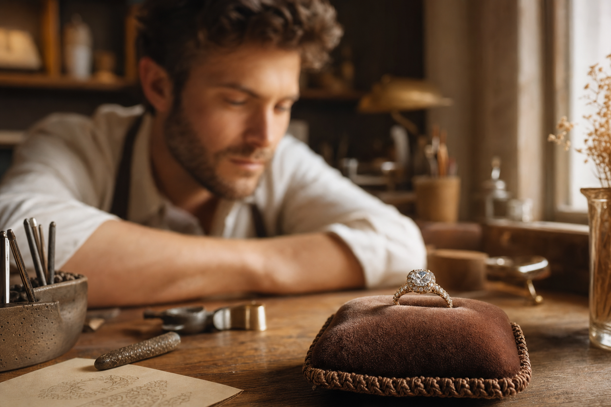
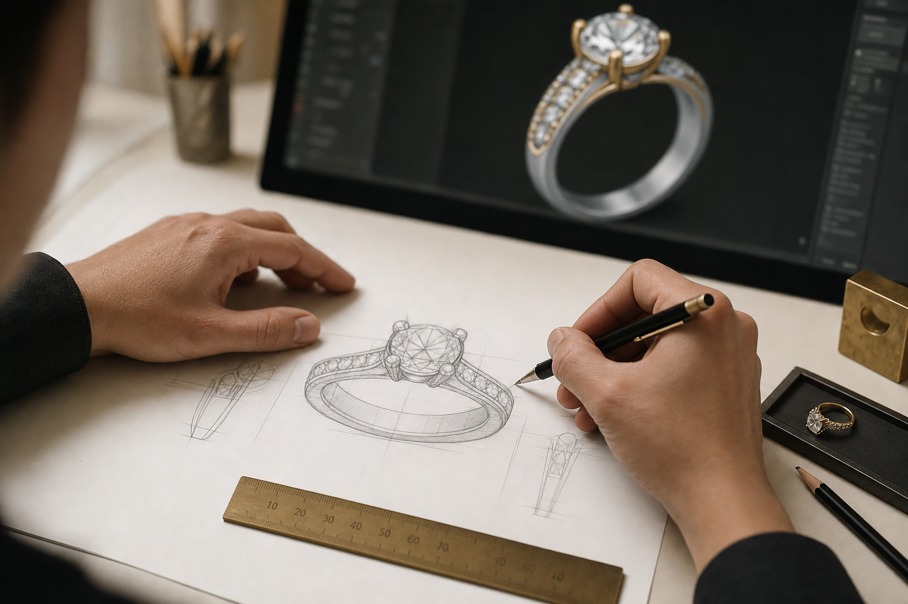
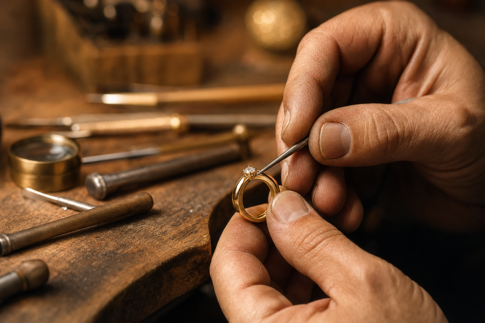
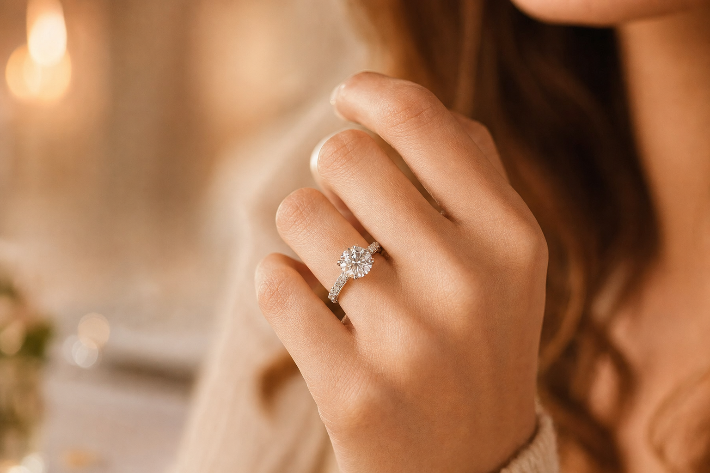

# איך מעצבים תכשיט מותאם אישית — המסע מהרעיון ועד התכשיט שעל היד

יש רגעים שתכשיט מהמדף פשוט לא עונה עליהם. הצעת נישואים, יום נישואים, לידה, או סתם רצון לשאת איתך משהו שאף אחד אחר בעולם לא נושא. בדיוק לשם כך קיים תכשיט מותאם אישית — *bespoke*. לא בחירה מתוך קטלוג, אלא יצירה שמתחילה מדף ריק ומסתיימת בחתיכה אחת ויחידה במינה, שנבנתה סביב סיפור מסוים, אדם מסוים, ורגע מסוים.

המאמר הזה לוקח אתכם דרך כל התהליך מקצה לקצה: איך נראית השיחה הראשונה, איך רעיון מעורפל הופך לסקיצה ואז למתכת, מהן נקודות העצירה החשובות, וכמה זמן וכסף זה באמת דורש. בין אם אתם לקוחות ששוקלים להזמין תכשיט כזה ובין אם אתם בצד של היוצרים — כך זה עובד.

## למה בכלל ללכת על תכשיט מותאם אישית

ההבדל הגדול בין תכשיט מדף לתכשיט bespoke הוא שליטה. כשמזמינים תכשיט מותאם אישית, כל החלטה היא שלכם — סוג המתכת, האבן המרכזית, הגוון, הפרופורציות, ועד הפרטים הקטנים ביותר שלא תמיד שמים לב אליהם בהתחלה. אתם מעורבים בכל שלב, מהשיחה הראשונה ועד הרגע שבו התכשיט עובר לידיכם.

התוצאה היא חתיכה שאי אפשר לשחזר. לא עוד דגם שמיוצר באלפי עותקים, אלא יצירה שנבנתה במיוחד עבורכם ומספרת את הסיפור שלכם. וכן — התהליך לוקח זמן ודורש מחשבה, אבל זה בדיוק מה שהופך אותו למשמעותי.

## שלב 1 — השיחה הראשונה: מאיפה מתחילים

כל תכשיט מותאם אישית מתחיל בשיחה. זו פגישת היכרות שבה מדברים על ההשראה לעיצוב, על הסגנון שאתם אוהבים, ועל מה התכשיט אמור לבטא. חלק מהלקוחות מגיעים עם חזון ברור; אחרים מגיעים עם תחושה בלבד. שניהם בסדר גמור.

זה גם השלב שבו בוחרים את הכיוון הסגנוני. יש שנמשכים ל-Art Deco עם הקווים הגיאומטריים והנקיים שלו, אחרים מעדיפים את הרומנטיקה של הסגנון הוויקטוריאני, את העדינות האדוארדיאנית, או דווקא קו מודרני ומינימליסטי. אין נכון ולא נכון — יש מה שמתאים לכם.

בשיחה הזו עולות כבר ההחלטות הגדולות:

- **המתכת** — פלטינה, זהב 18 קראט, זהב 14 קראט או כסף. לכל אחת מהן מראה, משקל ומחיר משלה.
- **האבנים** — יהלומים או אבני חן צבעוניות, טבעיות או מעבדה (lab-grown). שתי האפשרויות פתוחות, וזו החלטה שלכם.
- **לוח הזמנים** — תהליך מלא נמשך בדרך כלל כעשרה עד שנים-עשר שבועות מרגע מתן המקדמה.
- **התקציב** — חשוב לדבר עליו בפתיחות כבר עכשיו. משבצת (mounting) מותאמת אישית נעה לרוב בטווח של כ-3,500 עד 5,000 דולר, עוד לפני הוספת היהלומים או אבני החן.

טיפ אחד שחוזר על עצמו: הביאו השראה. תמונה מ-Pinterest, סקיצה מהירה, פיסת בד שאהבתם, ציור על מפית, או אפילו תיאור מילולי של תחושה. כל אלה עוזרים לתרגם את מה שבראש שלכם לשפה שאפשר לעבוד איתה.

## שלב 2 — מהרעיון לסקיצה והערכת עלות

אחרי שהכיוון התגבש, מגיע הפירוט. בשלב הזה מקבלים פירוק עלויות מלא ושקוף: אבנים, מתכת, עבודת היד, ותוספות אופציונליות כמו הערכת שמאי. המטרה היא שלא יהיו הפתעות בהמשך.

במקביל, הרעיון מתחיל לקבל צורה ויזואלית. נוצרת סקיצה בקנה מידה אמיתי של התכשיט המוגמר, לעיתים באמצעות מדפסת תלת-ממד, כך שאפשר להחזיק את הצורה ביד, למדוד אותה ואפילו למדוד אותה על האצבע — הרבה לפני שנוגעים במתכת היקרה.

שלב הסקיצה עצמו כרוך בעלות סמלית של כ-200 דולר, אך סכום זה מקוזז מהמחיר הסופי ברגע שמתקדמים ונותנים מקדמה. במילים אחרות, זו השקעה שחוזרת אליכם.

## שלב 3 — בחירת האבן וליטוש העיצוב הסופי

לב התכשיט הוא לרוב האבן המרכזית, ולכן היא מקבלת תשומת לב מיוחדת. בשלב הזה הצוות מאתר עבורכם כמה אפשרויות לאבן מרכז — בדרך כלל שלוש — כדי שתוכלו להשוות, להתלבט ולבחור באופן מושכל. ההבדלים בין אבן לאבן, אפילו אם הם דקים, יכולים לשנות לגמרי את אופי התכשיט.

אחרי שבחרתם, מוסיפים צבע לסקיצות הסופיות כדי שתוכלו לראות בקירוב רב ככל האפשר איך התכשיט ייראה במציאות. זה גם הרגע לעדן את התקציב ולהתאים אותו במדויק לרמת הנוחות שלכם, לפני שעוברים לשלב הבא. כשהכול מאושר — מבקשים מקדמה של 50 אחוז, וזה האות לפתיחת העבודה בפועל.

## שלב 4 — ההפקה: כאן הרעיון הופך למתכת

זהו השלב שבו החזון יוצא מהנייר אל העולם הפיזי. אחרי המקדמה מתחילה העבודה עצמה, והיא נמשכת בדרך כלל בין שמונה לשנים-עשר שבועות. התכשיט נבנה ביד או דרך מידול CAD לקראת יציקה, ועובר שורה של שלבים מדוקדקים. כדאי להכיר אותם, כי כל אחד מהם תורם לתוצאה הסופית:

1. **קונספט עיצובי ורינדור CAD** — מעבר לסקיצות ביד, רינדור תלת-ממדי ממוחשב מאפשר לראות איך האור ישחק עם האבנים ולבחון את הפרופורציות מכל זווית, עוד לפני שמתחילים לייצר.
2. **דגם שעווה** — זו אחת מנקודות הביקורת החשובות בתהליך כולו. נוצר דגם פיזי תלת-ממדי בשעווה שמאפשר לכם לאמת מידות, להעריך פרופורציות ולבקש שינויים — לפני שיוצקים את המתכת היקרה. כאן עוצרים, בודקים ומאשרים.
3. **יציקת מתכת** — דגם השעווה המאושר עובר יציקה בשיטת *lost wax*, שיטה עתיקת יומין שמספקת רמת פירוט ודיוק יוצאת דופן. השעווה מותכת ונעלמת, ומתכת מותכת ממלאת את התבנית שנותרה. כאן נבחר הגוון הסופי — זהב צהוב, לבן או ורוד, פלטינה או כסף.
4. **שיבוץ אבנים** — האבנים מוצמדות למקומן בטכניקות שונות: שיני אחיזה (prong), מסגרת סוגרת (bezel), תעלה (channel) או שיבוץ צפוף (pavé). הבחירה בטכניקה משפיעה גם על המראה וגם על מידת ההגנה על האבן.
5. **גימור וליטוש** — התכשיט עובר כמה שלבי ליטוש, מהחלקה ראשונית ועד הברקה מבריקה במיוחד, ולעיתים גם עיטורים כמו טקסטורה או חריטה.

## שלב 5 — בקרת איכות והרגע הגדול

לפני שהתכשיט נמסר, הוא עובר בדיקה סופית קפדנית. בעזרת הגדלה בודקים את שלושת הדברים שקובעים את איכות התכשיט לאורך שנים: יציבות האבנים במקומן, שלמות המתכת, ואיכות הגימור. רק כשהכול עומד בסטנדרט, התכשיט מוכן.

ואז מגיע הרגע שלשמו התחיל הכול. יחד עם התכשיט המוגמר מקבלים גם הערכת ביטוח (insurance appraisal), שמאפשרת לבטח את היצירה כראוי. את התשלום הסופי אפשר להסדיר באיסוף או לאורך תהליך ההפקה.

## כמה זמן זה באמת לוקח — ולמה זה שווה

חשוב לגשת לתהליך עם ציפיות נכונות. מקצה לקצה, תכשיט מותאם אישית לוקח בדרך כלל בין ארבעה לשנים-עשר שבועות, תלוי במורכבות. דווקא שלב העיצוב הראשוני נוטה להיות הארוך ביותר — ככל שהעיצוב מורכב יותר וככל שיש יותר סבבי תיקונים, כך זה יתארך.

אבל זה בדיוק העניין. תכשיט bespoke הוא לא מוצר שקונים, הוא תהליך שעוברים. השקיפות התקציבית מההתחלה, נקודות העצירה לאישור לאורך הדרך, והמעורבות שלכם בכל החלטה — כל אלה הופכים את התוצאה למשהו שמרגישים מחובר אליו. בסוף הדרך לא מקבלים רק תכשיט. מקבלים סיפור שאפשר לענוד.
