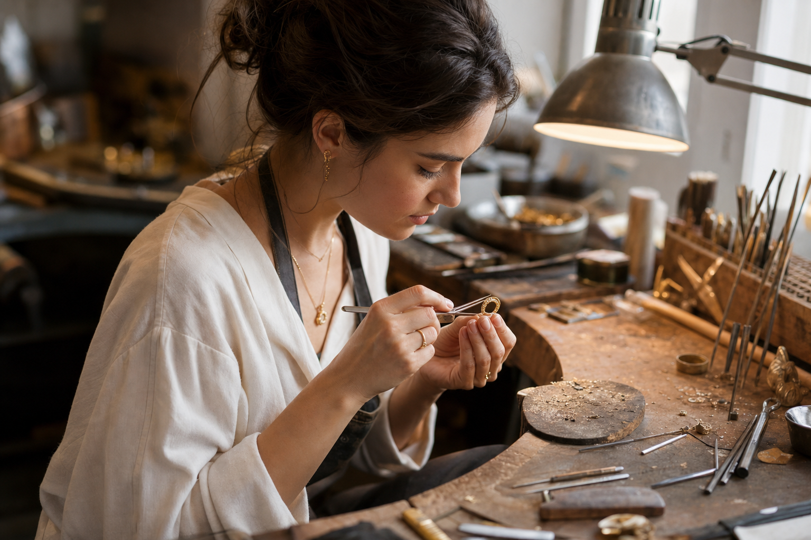
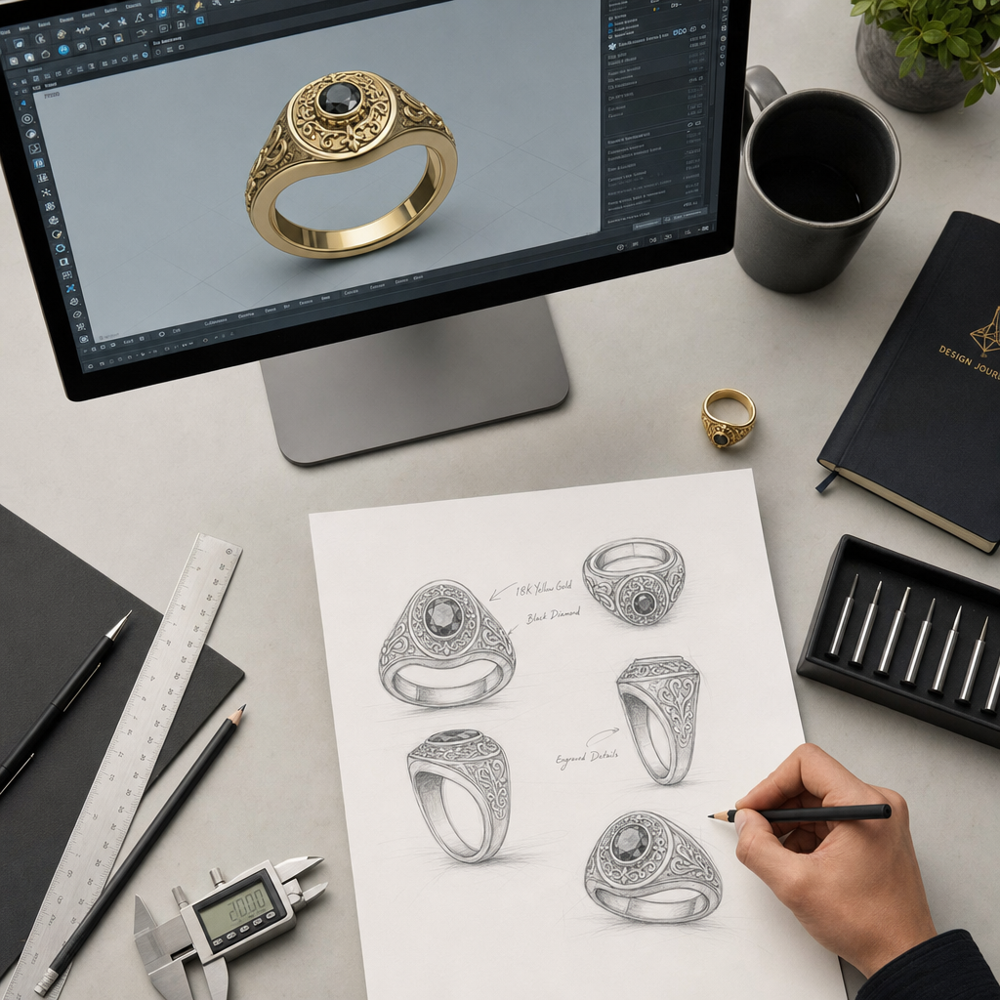

# אילו כישורים באמת צריך כדי להיות מעצב תכשיטים

יש משהו מפתה במחשבה על מעצב תכשיטים: דמות שיושבת מול שולחן עבודה, מסובבת טבעת לאור, וממציאה יופי קטן מתוך מתכת ואבן. אבל מאחורי התמונה הזאת מסתתר מקצוע תובעני, שמשלב בין שלושה עולמות שלא תמיד מסתדרים זה עם זה: כישרון אמנותי, מיומנות טכנית מדויקת, והבנה עסקית של שוק אמיתי. מי שמצליח לחבר את השלושה — מצליח להפוך רעיון לפריט שאנשים רוצים לענוד, ולשלם עליו.

המדריך הזה עושה סדר. נעבור על ארבעת הצירים שמרכיבים את המקצוע — היכולות הטכניות, היכולות האמנותיות, מסלולי ההכשרה, והכישורים העסקיים והרכים — ונראה איך הם משתלבים למסלול קריירה אמיתי.

## הציר הטכני: היכולת להפוך רעיון לחפץ

זה החלק שבו הרעיון פוגש את המציאות. אפשר לחלום על העיצוב הכי יפה בעולם, אבל אם אי אפשר לייצר אותו — הוא יישאר על הנייר. הציר הטכני נשען על שלושה עמודי תווך.

### סקיצה ו-CAD: שתי שפות, לא אחת

כל עיצוב מתחיל בסקיצה. היכולת לרשום תכשיט ביד — לתפוס פרופורציה, נפח וזווית בכמה קווים מהירים — היא עדיין הבסיס. אבל היום זה רק חצי מהסיפור. השליטה בתוכנות CAD הפכה מיכולת "נחמד שיש" ליכולת חיונית. מי שלא יודע למדל בתלת-ממד פשוט מתקשה להתחרות בשוק הגלובלי.

הכלים המרכזיים בתחום הם **Rhino**, **MatrixGold** ו-**ZBrush** למידול עצמו, ותוכנות רנדור כמו **Keyshot** ו-**V-Ray** ליצירת הדמיות פוטוריאליסטיות — תמונות שנראות כמו צילום של תכשיט קיים, עוד לפני שיוצר אפילו אבטיפוס אחד. לצד אלה, היכרות עם **Adobe Photoshop ו-Illustrator** עוזרת בהצגת העיצובים, וידע ברישום טכני וכתיבת מפרטים מבטיח שמי שמייצר בפועל יבין בדיוק מה התכוונתם.

יש כאן נקודה ששווה לעצור עליה: יצרנים מזהים מיד את ההבדל בין שרטוט של מי שמעולם לא ישב ליד שולחן העבודה לבין מי שכן. כשמבינים איך תכשיט באמת מורכב, השרטוטים נעשים מדויקים, ריאליים, וניתנים לייצור. הידע הטכני לא רק מייפה את העיצוב — הוא מציל אותו.

### עבודת מתכת וייצור

כאן נכנסת המלאכה הפיזית. מטאלסמיתינג — עבודת המתכת — כולל הלחמה (soldering), פילינג (filing) וליטוש (polishing), לצד שיבוץ ומיקום מדויק של אבני חן. צריך להכיר את המתכות היקרות ואת תכונות הסגסוגות, לדעת לגלף אבטיפוס בשעווה (wax carving), ולהבין את תהליכי הייצור השונים: יציקה (casting), הטבעה (stamping), הרכבה (fabrication) והדפסת תלת-ממד. גם מי שלא מתכוון לעבוד ליד השולחן כל היום — חייב להבין מה קורה שם, כדי לעצב דברים שאפשר באמת לבנות.

### אבני חן וחומרים

הציר השלישי הוא הידע על החומר עצמו. גמולוגיה ודירוג יהלומים (diamond grading), זיהוי תכונות של אבני חן, ובחירת חומרים שמתאימים גם לאסתטיקה של העיצוב וגם לתקציב של הלקוח. בשנים האחרונות נכנסו לתמונה גם חומרים חלופיים ובני-קיימא — בהם יהלומי מעבדה — והיכרות איתם הפכה ליתרון של ממש. לצד כל זה, היכולת להעריך עלויות ולנהל רכש חומרים (sourcing) היא מה שמחבר בין החלום העיצובי לבין השורה התחתונה.

## הציר האמנותי: מה שמבדיל אתכם מכולם

הטכניקה מאפשרת לייצר. האמנות היא הסיבה שמישהו ירצה דווקא את מה שאתם יוצרים. מעבר למיומנות, מעצב טוב מפתח אסתטיקה ייחודית וגישה קונספטואלית משלו. זה כולל **חזון אמנותי ומקוריות** שמובילים לעיצובים חדשניים, **מודעות לטרנדים** והבנה של תנועות אופנה עכשוויות, ו**חשיבה קונספטואלית** — היכולת לתרגם השראה מופשטת לפריט מוחשי שאפשר לענוד.

לזה מתווספים שני כישורים שנשמעים קטנים אבל מכריעים: **תשומת לב לפרטים**, כי בתכשיט מילימטר עושה את ההבדל, ו**פתרון בעיות**, כי בין הרעיון לתוצר תמיד צצים אתגרים שדורשים פתרון יצירתי.

## הציר השלישי: איך לומדים את זה בכלל

אין מסלול אחד נכון. יש כמה דרכים להגיע, וכל אחת מתאימה לאופי ולנקודת הפתיחה אחרת.

**תארים פורמליים** — תואר ראשון בעיצוב תכשיטים, אמנויות, עיצוב אופנה או עיצוב תעשייתי נמשך בדרך כלל בין שנתיים לארבע. הוא נותן בסיס רחב, אפשרויות התמחות, וחשוב לא פחות — קשרים בתעשייה.

**תוכניות מקצועיות ותעודה** — קצרות יותר, ממוקדות מאוד בכישורים מעשיים כמו CAD, שיבוץ אבנים וגילוף שעווה. נמשכות ממספר שבועות ועד שנתיים, ומתאימות למי שרוצה להיכנס לעבודה מהר.

**חניכות (Apprenticeship)** — הכשרה ישירה לצד צורף מנוסה. זה המסלול המעשי ביותר, והוא מאיץ את פיתוח המיומנות בזכות מנטורינג וניסיון אמיתי מהשטח.

**לימוד עצמי ואונליין** — פלטפורמות כמו **Ganoksin** ו-**New Approach School for Jewelers** מציעות חומר בעלויות נמוכות. היתרון הוא גמישות מלאה; החיסרון הוא שהוא דורש משמעת עצמית גבוהה.

לצד כל אלה, יש הסמכות שנושאות משקל בתעשייה — בראשן תעודת **GIA Graduate Gemologist** ו-**GIA Graduate Jeweler**, וכן קורסי CAD ייעודיים.

הערה לקהל הישראלי: רוב המספרים על עלויות לימוד במקורות הבינלאומיים מתייחסים לשוק האמריקאי, שבו תואר מלא יכול לנוע בין עשרות אלפי דולרים למעלה מכך, ותוכניות תעודה בטווח נמוך יותר. בארץ התמונה שונה — כדאי לבדוק את המוסדות והעלויות המקומיים ישירות. עיקרון אחד נשאר נכון בכל מקום: השקעה בידע נכון מחזירה את עצמה.

## הציר העסקי והרך: מה שלא לומדים בשרטוט

הרבה מעצבים מוכשרים נתקעים בדיוק כאן. כי לעצב יפה זה לא מספיק — צריך לדעת לתקשר, למכור ולנהל. הכישורים הרכים והעסקיים הם לעיתים קרובות מה שמפריד בין תחביב למקצוע.

- **תקשורת והצגה** — היכולת לבטא קונספט עיצובי בצורה שגורמת ללקוח להתאהב בו.
- **גמישות ופתיחות למשוב** — תיקונים הם חלק מהעבודה, לא עלבון אישי.
- **סבלנות והתמדה** — תהליך עיצוב הוא איטרטיבי, וכמעט אף פעם לא יוצא מושלם בניסיון הראשון.
- **חוש עסקי** — הבנה של ביקושי השוק ושל תמחור נכון.
- **ניהול פרויקטים** — שליטה בלוחות זמנים ובתקציב.
- **רישות (networking)** — נוכחות בקהילות התכשיטנות והעיצוב פותחת דלתות.
- **פוטנציאל מנהיגותי** — מה שמאפשר בהמשך לצמוח לתפקידים בכירים.

## מאיפה מתחילים: מסלול בשלבים

אם כל זה נשמע כמו הר גבוה, הנה דרך לטפס עליו צעד-צעד:

1. **בונים כישורי יסוד** — מטאלסמיתינג, שיבוץ אבנים, גילוף שעווה ו-CAD. זה הבסיס שהכל יושב עליו.
2. **מגבשים אסתטיקה ייחודית** — מתנסים בחומרים, בצורות ובהשראות עד שמתגבש קול אישי שמזהים מרחוק.
3. **בונים פורטפוליו מקצועי** — חמישה עד שבעה פריטים מוגמרים, לצד סקיצות, mood boards ותיעוד תהליך, הכל בצילום מקצועי.
4. **מרשתים ומחפשים מנטור** — ירידי אומנות, אירועי תעשייה ופורומים מקצועיים.
5. **מתכוננים לחיפוש עבודה** — קורות חיים ממוקדים; ולמי שבוחר במסלול יזמי, גם ידע עסקי ושיווקי.
6. **מגישים מועמדות** — למשרות כניסה כעוזר מעצב, לחניכות או להתמחות. או, לחלופין, משיקים עסק עצמאי קטן.

## לאן השוק הולך

המקצוע משתנה מתחת לרגליים. הביקוש למעצבים ששולטים ב-CAD רק גובר, לצד מיקוד הולך וגדל בקיימות ובמקורות אתיים, ובהעדפה ברורה של צרכנים לפריטים מותאמים אישית. גם העבודה מרחוק חדרה לתחום — לפחות בשלבי הקונספט.

ובאופק כבר מנצנצות התמחויות חדשות לגמרי: עיצוב תכשיטים למרחבים וירטואליים ולמציאות רבודה, תכשיטים חכמים שמשלבים סנסורים ו-LED, תכשיטים בני-קיימא בלוגיקה של כלכלה מעגלית, עיצוב נעזר בבינה מלאכותית גנרטיבית, ואפילו תכשיטים טיפוליים ובריאותיים.

## שורה תחתונה

אין קיצור דרך. מעצב תכשיטים טוב הוא מי שיודע לרשום וגם למדל, להבין מתכת וגם אבן, ליצור יופי וגם למכור אותו. זה שילוב נדיר — וזה בדיוק מה שהופך את המקצוע למה שהוא. מי שמוכן להשקיע בכל ארבעת הצירים, ולא להתאהב רק באחד מהם, ימצא את עצמו לא רק מעצב תכשיטים — אלא בונה קריירה שלמה.
