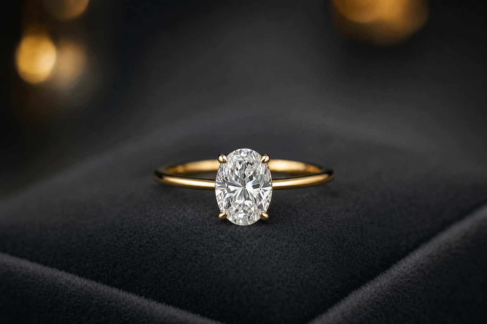
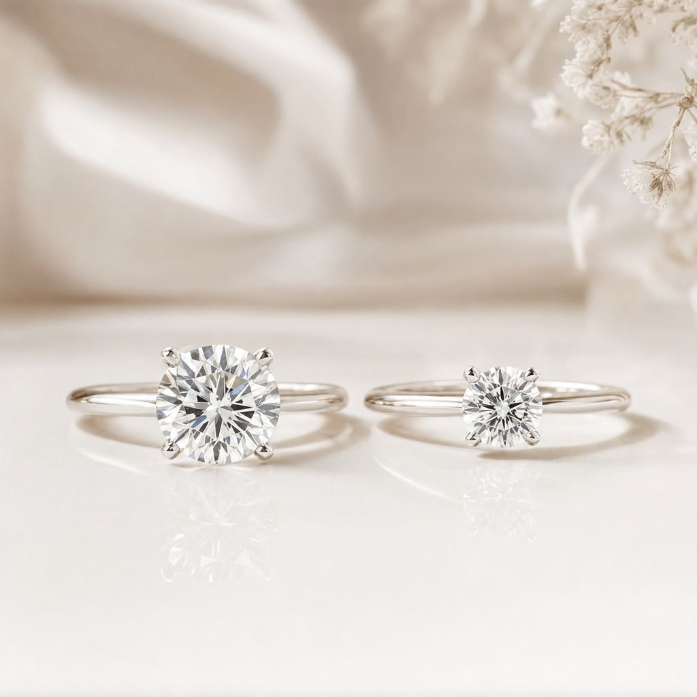

# למה רוב הזוגות בוחרים ב-2026 יהלום מעבדה — ומה זה אומר על הטבעת שלכם

יש שנים שבהן הטרנד הגדול בעולם טבעות האירוסין הוא צורת חיתוך חדשה, או דרך שיבוץ מקורית. 2026 שונה. השינוי הגדול השנה הוא לא עיצובי בכלל — הוא תפיסתי. בפעם הראשונה בהיסטוריה, רוב הזוגות שמתארסים בוחרים בטבעת המשובצת ביהלום מעבדה ולא ביהלום טבעי.

זה לא עוד טרנד שיחלוף עם העונה. זהו מפנה מבני בשוק שהיה נשלט במשך עשורים כמעט לחלוטין על ידי יהלומים טבעיים. כדי להבין כמה השינוי דרמטי, מספיק להסתכל על המספרים.

## הרוב כבר עבר את הקו

לפי מחקר של The Knot, **61%** מטבעות האירוסין הנמכרות כיום משובצות ביהלום מעבדה. גם מי שזהיר יותר בהערכות, כמו האנליסט אדהן גולן, מציב את הנתון על מעל 50%. כך או כך — מדובר ברוב ברור.

המגמה ניכרת היטב בתנועה של השוק: מכירות יהלומי המעבדה זינקו בכ-31% בערך הכספי ובכ-30% במספר היחידות. במקביל, היהלומים הטבעיים נסוגו — ירידה של כ-4% במכירות וכ-2% ביחידות בנתוני 2025. הכיוון ברור, והוא חד-צדדי.

## הסיבה האמיתית: פרגמטיות כלכלית

כשמנסים להבין למה זה קורה, התשובה פשוטה ומפוכחת: כסף. הסיבה מספר אחת שזוגות נותנים לבחירה ביהלום מעבדה היא פרגמטיות כלכלית — באותו תקציב בדיוק אפשר לקבל אבן גדולה יותר, בצבע טוב יותר ובניקיון גבוה יותר.

הצרכן הצעיר של 2026 מגיע עם מנטליות קנייה שונה לחלוטין מזו של הדורות הקודמים. הוא לא רואה ביהלום המעבדה "פשרה" או "תחליף", אלא בחירה לגיטימית ונבונה. הנתון שמסכם את כל הסיפור: ההוצאה הממוצעת על טבעת אירוסין ירדה בשנת 2025 לכ-4,600 דולר, לעומת כ-6,000 דולר ב-2021. כשהמחיר לקרט יורד, אפשר פשוט לקבל יותר תמורת אותו הכסף.

## כשהכלכלה משנה את העיצוב

הדבר המעניין הוא שהמעבר ליהלומי מעבדה לא נשאר רק בתקציב — הוא מחלחל לכל החלטות העיצוב. כשאפשר להרשות לעצמך אבן גדולה יותר, משתנות גם הצורות, המתכות והשיבוצים שאנשים בוחרים.

### צורות חיתוך: העגול כבר לא לבד

החיתוך העגול, שנים המלך הבלתי מעורער, מחזיק עדיין במקום הראשון — אך בקושי. הנה התמונה כיום:

- **עגול (Round):** 26% — עדיין ראשון, אך כבר לא ללא תחרות.
- **אובל (Oval):** 25% — כמעט צמוד לעגול, מה שמכונה "אפקט היילי ביבר".
- **אמרלד, אגס (pear), מרקיזה ונסיכה (princess):** כ-8% כל אחת.
- **כרית (cushion) ורדיאנט:** כ-6% כל אחת.

המגמה הרחבה ברורה: אבנים מאורכות צוברות פופולריות. וזה לא במקרה — המחירים האטרקטיביים של יהלומי המעבדה מאפשרים להגיע לגדלים מרשימים יותר, והצורות המאורכות מנצלות את זה היטב ונראות גדולות במיוחד.

### מתכות: הזהב הצהוב חוזר בגדול

גם בזירת המתכות יש תנועה. המתכות הלבנות עדיין מובילות עם 48% (מתוכן 35% זהב לבן ו-13% פלטינה), אך הזהב הצהוב מטפס במהירות ומחזיק כבר ב-39% — נתון שהוכפל בחמש השנים האחרונות.

מאחורי העלייה הזו עומדים שני מנועים: השפעת הסלבריטאים, ובראשם טבעת הזהב הצהוב של מייגן מרקל מ-2017, והרצון של זוגות בטבעת שמשתלבת בקלות עם שאר התכשיטים שהם עונדים ביומיום.

### שיבוצים: בולטים ומסיביים יותר

לבסוף, גם דרך השיבוץ משתנה. הפסים נעשים עבים יותר, ושיבוצי Bezel ו-Burnish — שבהם המתכת עוטפת את האבן — נמצאים במגמת עלייה כבר שלוש שנים ברציפות. המגמה הכללית היא לעבר שיבוצים מסיביים יותר, שבהם המתכת חשובה לא פחות מהיהלום עצמו.

## גם דרך הקנייה השתנתה

מעבר לטבעת עצמה, השתנתה גם הדרך שבה זוגות מגיעים אליה. הרכישה כבר מזמן אינה הפתעה חד-צדדית: **79%** מהמקבלים השתתפו בבחירת הטבעת, ו-**25%** קנו אותה יחד כזוג. זה מתחבר היטב למציאות זוגית אחרת — **70%** מהזוגות כבר גרו יחד עוד לפני האירוסין.

במילים אחרות, ההחלטה על הטבעת הפכה למשותפת, מושכלת ופחות טקסית. וכשהבחירה משותפת, גם השיקול הפרגמטי — לקבל יותר בפחות — תופס מקום טבעי בשיחה.

## מה זה אומר על הטבעת שלכם

הסיפור של 2026 הוא לא "עוד טרנד" שכדאי לעקוב אחריו, אלא מפנה שמשנה את כללי המשחק. יהלום המעבדה עבר מ"אלטרנטיבה" ל"ברירת המחדל" של רוב הזוגות, וזה משפיע על כל שרשרת ההחלטות: התקציב, גודל האבן, הצורה והשיבוץ.

מבחינתכם, המשמעות מעודדת. הבחירה ביהלום מעבדה כבר אינה דורשת הצדקה, והיא פותחת דלת לטבעת מרשימה יותר באותו תקציב — אבן גדולה יותר, צורה מאורכת ומחמיאה, וזהב צהוב חם שחוזר לאופנה. בסופו של דבר, הטבעת הטובה ביותר היא זו שמשקפת את הטעם שלכם ואת השיקולים שלכם — וב-2026 יש לכם יותר חופש לעצב אותה בדיוק כך.
